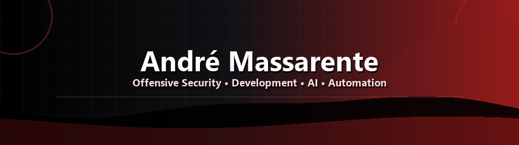

<div align="center">




<br/>


<br/><br/>

<a href="https://www.linkedin.com/in/andremassarente/">
  
</a>


</div>

---

## 👾 Sobre mim

Sou **André Massarente**, estudante de **Ciência da Computação** com foco em **Offensive Security**, **desenvolvimento**, **IA** e **automação**.

Gosto de criar ferramentas práticas, automatizar tarefas repetitivas, entender como sistemas funcionam por dentro e transformar aprendizado técnico em projetos reais.

```txt
root@portfolio:~$ whoami
offensive security • desenvolvimento • ia • automação • linux
```

---

## 🧨 Focos principais

<table>
  <tr>
    <td width="50%" valign="top">
      <h3>🛡️ Offensive Security</h3>
      <p>Reconhecimento, enumeração, OWASP, análise de superfície de ataque, metodologia de testes de segurança e mentalidade de exploração ética.</p>
    </td>
    <td width="50%" valign="top">
      <h3>💻 Development</h3>
      <p>Python, JavaScript/TypeScript, Java, APIs, estrutura limpa, fluxos com Git/GitHub e organização de projetos manuteníveis.</p>
    </td>
  </tr>
  <tr>
    <td width="50%" valign="top">
      <h3>⚙️ Automation</h3>
      <p>Scripts em Python e Bash para reduzir trabalho manual, coletar dados, criar ferramentas e construir fluxos técnicos reproduzíveis.</p>
    </td>
    <td width="50%" valign="top">
      <h3>🤖 AI</h3>
      <p>Uso de agentes, prompts e fluxos com IA para acelerar pesquisa, documentação, programação, análise e produtividade.</p>
    </td>
  </tr>
</table>

---

## 🧰 Stack principal

<div align="center">

<strong>Linguagens & scripting</strong>

<br/><br/>


<br/><br/>

<strong>Ambiente, segurança & cloud</strong>

<br/><br/>


</div>

---

## 🎓 Certificação

<div align="center">


<br/>

**AWS Certified Cloud Practitioner**

</div>

---

<div align="center">


</div>
