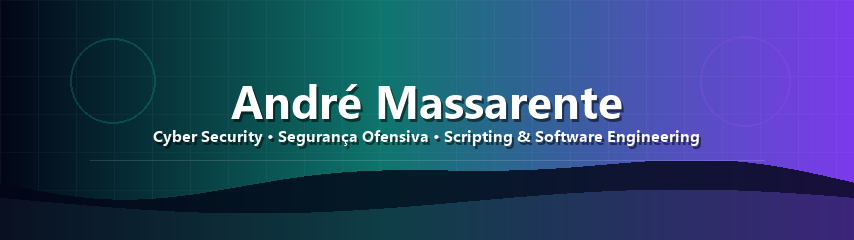

<div align="center">




<br/>


<br/><br/>

<a href="https://www.linkedin.com/in/andremassarente/">
  
</a>


</div>

---

## 👾 Quem sou

Sou **André Massarente**, estudante de **Ciência da Computação** e profissional na área de **Cyber Security**, com foco em **Segurança Ofensiva**.

Busco evoluir como **Analista Jr de Cyber Security** e futuro **pentester**, construindo uma base forte em segurança, programação, Linux, redes, automação e engenharia de software.

```txt
root@portfolio:~$ whoami
cyber security • segurança ofensiva • pentest • scripting • linux • software engineering
```

---

## 🧨 Especialidades em evolução

<table>
  <tr>
    <td width="50%" valign="top">
      <h3>🛡️ Segurança Ofensiva</h3>
      <p>Pentest, reconhecimento, enumeração, OWASP, análise de superfície de ataque e mentalidade de exploração ética.</p>
    </td>
    <td width="50%" valign="top">
      <h3>⚙️ Scripting & Automação</h3>
      <p>Python e Bash para criar ferramentas, automatizar tarefas repetitivas e transformar processos manuais em fluxos reproduzíveis.</p>
    </td>
  </tr>
  <tr>
    <td width="50%" valign="top">
      <h3>🐧 Linux & Redes</h3>
      <p>Terminal, sistemas Linux, fundamentos de redes, troubleshooting, serviços, permissões e práticas de hardening.</p>
    </td>
    <td width="50%" valign="top">
      <h3>💻 Software Engineering</h3>
      <p>Desenvolvimento de aplicações, organização de código, Git/GitHub, APIs, documentação de projeto e boas práticas de manutenção.</p>
    </td>
  </tr>
</table>

<div align="center">


</div>

---

## 🎓 Certificações

<div align="center">


</div>

---

<div align="center">


</div>
